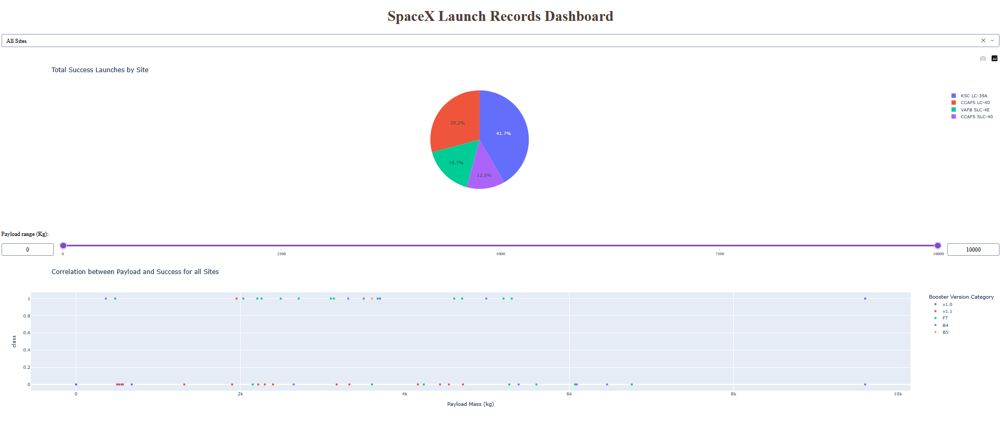

# SpaceX Launch Dashboard

An interactive [Plotly Dash](https://dash.plotly.com/) application for exploring
Falcon 9 launch records and first-stage landing outcomes.

<p align="center">
  
</p>

## Features

- **Launch site selector** — a searchable dropdown to view all sites at once
  (`CCAFS LC-40`, `VAFB SLC-4E`, `KSC LC-39A`, `CCAFS SLC-40`) or filter down
  to a single site.
- **Success breakdown pie chart** — shows total successful launches by site
  when "All Sites" is selected, or the success-vs-failure split for a single
  selected site.
- **Payload mass range slider** — filters both charts to only include
  launches within the selected payload range (0–10,000 kg).
- **Payload vs. success scatter chart** — plots payload mass against landing
  outcome, colored by booster version category, updating live as the site
  and payload filters change.

All four controls are linked: changing the site dropdown or the payload
slider updates both charts immediately, no page reload needed.

## Data

The dashboard reads `data/processed/spacex_launch_dash.csv` (resolved
relative to `app.py`, so it works regardless of which directory you launch
it from). This file is generated by the data-wrangling notebook
(`notebooks/03-data-wrangling.ipynb`) and is already included in the
repository, so no extra setup is needed to run the dashboard on its own.

## Running the dashboard

From the repository root:

```bash
pip install -r requirements.txt
python dashboard/app.py
```

Dash's development server starts at `http://127.0.0.1:8050` by default —
open that URL in a browser once the terminal shows it's running.

> This runs Dash's built-in development server, which is fine for local use
> and demos but isn't intended for production traffic. See the main
> [README's Future Improvements](../README.md#future-improvements) section
> for notes on containerizing and deploying it properly.
